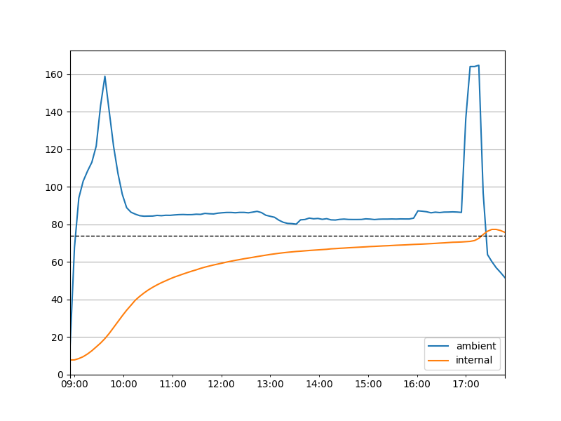

# MEATER Cloud API

This is a first draft to access data from the (private) MEATER Cloud API, reverse engineered from the iOS app.
Unlike the public API documented in https://github.com/apption-labs/meater-cloud-public-rest-api, the private API 
also exposes (finished) cooks and allows access to all their historical temperature data, even without the probe being available in-app.

For now, this serves as a proof-of-concept, thus use at your own risk.

Note - most temperature-related fields seem to contain the values as °C, multiplied by 32.

